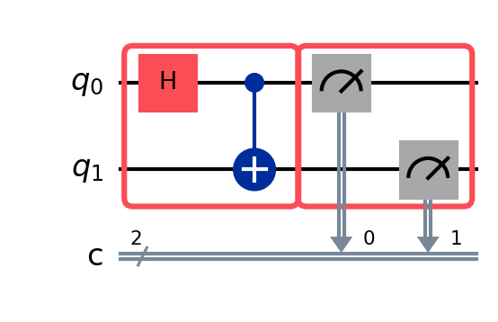
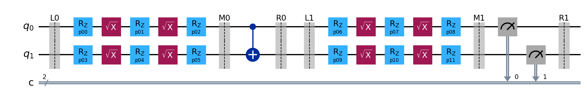
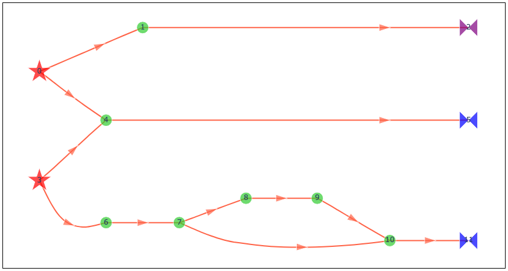
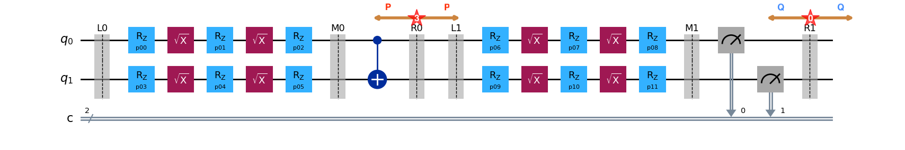

## How Samplomatic performs twirling?

Consider a bell circuit to which we are applying twirl operation on the two-qubit operation and measurement.  We would need to group the operations using box and the annotate the box with `Twirl` directive. The position where the dressing needs to be applied should be mentioned in the `Twirl` annotations The circuit is then considered as a declarative model of randomization.

<!-- In Samplomatic, twirl  be done using `Twirl` annotations on the box. To implement twirling samplomatic add parametric gate operation called `dressing` on left/right side of box. The dressing takes care of the implementation of gates in the circuit along with the random Pauli gates required for twirling.  -->

<!-- {height=20%} -->

Samplomatic would take such a boxed up circuit as input and builds a procedural representation of randomization using `build` method. The `build` method would output to objects; a Template circuit and a Samplex.

Template circuit from the Bell circuit:

Samplex from the Bell circuit:

<!-- {height=40%} -->

The template circuit will be structurally similar to the original circuit bell circuit with annotations. The parametric gates between `L0` (`L1`) and `M0`(`M1`) is called dressing and by default it will be on the left side of the box unless specified. The template circuit will be executed inplace of the original circuit as required randomizations could easily implemented choosing appropriate parameter values for dressing. Further, parameter values 

The parameter values required for randomization will be supplied by Samplex object, which is a main type defined in Samplomatic. 

<!-- Using the boxed up circuit with annotations, samplomatic construct an template circuit which will be used for randomizations in the subsequent steps.  The template circuit of the above circuit is as follows: -->

In the template circuit, the barriers `L0` and `R0` represents the scope of Box-1. Similarly, barriers `L1` and `R1` represents the scope of Box-2. The parametric gates between `L0` (`L1`) and `M0`(`M1`) is called dressing and by default it will be on the left side of the box unless specified. The dressing gates are used to implement gate operations in the circuit such as `Hadamard` operation in the qubit-0 and random Pauli gate operations that are applied due to twirling. As the name implies, the template circuit defines the structure of the circuit that will be executed. 

The template circuit does not store or remembers the Hadamard operation on qubit-0 within Box-1. It is the responsibility of Samplex object to implement the Hadamard gate along with the Pauli gates for twirling during runtime. Before, delving into Samplex, let's look into how twirling will get implemented in Samplomatic.

### Implementating twirling with dressing

The random Pauli layer added as a part of twirling is considered as `virtual` as they do not add any additional operations to the circuit, but instead act as a directive to alter how adjacent single-qubit gates are implemented. To enact the twirl directive, samplomatic generates virtual gates on the boundary of the box opposite to its dressing. In the case of template circuit we are discussing, virtual gates are generated at the barriers are generated at `R0` and `R1` and propagated left and rightwards. 

At the barrier `R0`, virtual gate layers $P \cdot P$ will be generated. The virtual gates propagating leftwards will get mutated as it propagates through $CZ$ gate due to commutation relations. When a Pauli gate $P$ propagate across a clifford gate $C$, the Pauli gate would get transformed as $P^{'} = CPC^{\dagger}$. Now, the Hadamard operation on the qubit-0 also have to be taken care. The virtual gates at qubit-0 will be right multiplied against Hadmard gates. Then virtual gates needs to be converted into parameter values and will get collected in the dressing (between `L0` and `M0`). Similarly, virtual gates that propagates rightwards from `R0` also get accumulated in the dressing between `L1` and `M1`.

Similar procedure is also followed at the barrier `R1` and virtual gate layers $Q \cdot Q$ will be generated. The virtual gates propagating leftwards will be collected in the dressing between `L1` and `M1`. The gates propagating in rightwards will post-processed as bit flips on measurement results.

In short,  samplomatic converts a boxed up circuits with directives into a procedural representation of the randomization. The template circuit gives the structure of the circuit that have to executed. The samplex will keep track of the mutation happening to virtual gates as it propagates across the circuit and gives the parameter values for dressing layer. 

> [!NOTE]
> The Propagation of Pauli gates across of Clifford gates follows this logic: 
>
> $$C \cdot P = C \cdot P \cdot (C^{\dagger}C) 
= (CPC^{\dagger})\cdot C = P^{'}\cdot C$$ 
> The above expression explains the logic of propagating **from right to left**. While propagating gates **from left to right**:
> $$ P \cdot C = (CC^{\dagger}) \cdot P \cdot C = C \cdot (C^{\dagger}PC) = C \cdot P^{'} $$

> [!Caution]
> . How Pauli gates propagates across non-clifford gates?
>
> . Can dressing have two qubit operations like Rzz($\theta$)? What happens if we box up an Rzz operation with CZ operation and apply twirling?
> 
> . Why gates are not getting mutated as it move past the measurement operations?
> 
> . Is it possible to do
