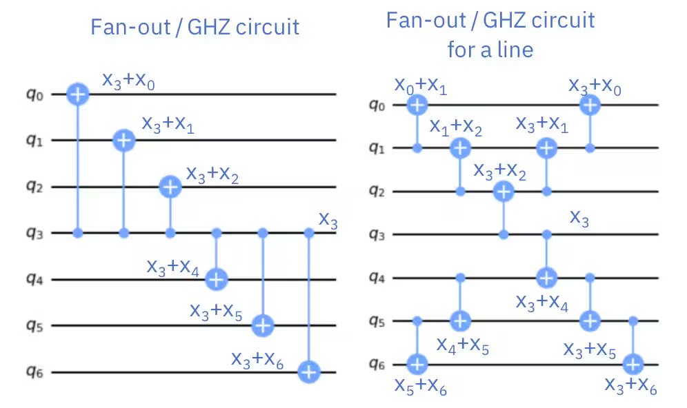

Critical steps in transpilation
    
- qubit layout --> mapping logical qubits to physical qubits
- gate routing 

SABRE: SWAP - Based Bidirectional Heuristic Algorithm

- performs both layout and routing.

To run SABRE we require:

- DAG representation of a circuit
- coupling map from backend
- SABRE pass 

SabreLayout Pass --> performs both layout and routing trials?
- internally optimizes both layout and routing by storing the solution that adds least number of swap gates.

Experiment:

-  GHZ state on linear-topology v/s GHZ state on star-topology 

```
______Linear Topology__________

        ┌───┐                ░ ┌─┐         
   q_0: ┤ H ├──■─────────────░─┤M├─────────   
        └───┘┌─┴─┐           ░ └╥┘┌─┐      
   q_1: ─────┤ X ├──■────────░──╫─┤M├──────
             └───┘┌─┴─┐      ░  ║ └╥┘┌─┐   
   q_2: ──────────┤ X ├──■───░──╫──╫─┤M├───
                  └───┘┌─┴─┐ ░  ║  ║ └╥┘┌─┐
   q_3: ───────────────┤ X ├─░──╫──╫──╫─┤M├
                       └───┘ ░  ║  ║  ║ └╥┘
meas: 4/════════════════════════╩══╩══╩══╩═
                                0  1  2  3 

______Star Topology_____________

        ┌───┐                ░ ┌─┐         
   q_0: ┤ H ├──■────■────■───░─┤M├─────────
        └───┘┌─┴─┐  │    │   ░ └╥┘┌─┐      
   q_1: ─────┤ X ├──┼────┼───░──╫─┤M├──────
             └───┘┌─┴─┐  │   ░  ║ └╥┘┌─┐   
   q_2: ──────────┤ X ├──┼───░──╫──╫─┤M├───
                  └───┘┌─┴─┐ ░  ║  ║ └╥┘┌─┐
   q_3: ───────────────┤ X ├─░──╫──╫──╫─┤M├
                       └───┘ ░  ║  ║  ║ └╥┘
meas: 4/════════════════════════╩══╩══╩══╩═
                                0  1  2  3 
```

- linear-topology GHZ state could be trivially implemented with $\mathcal O(N)$ depth on a linear coupling map without any SWAP gates.
- star-topology GHZ state also could be implemented with $\mathcal O(N)$ depth on a linear coupling map without any SWAP gates. However, we would require some manipulations. 

    - The HighLevelSynthesis could be used generate optimal $\mathcal O(N)$ depth circuit without introducing SWAP gates as shown in the figure.

    

     - StarPrerouting can further reduce the depth by introducing swaps!! (how it is working)
      
       - StarPrerouting rewrites any solely 2q gate star connectivity subcircuit as a linear connectivity

       - There is no pass that convert do linear to star conversion.


